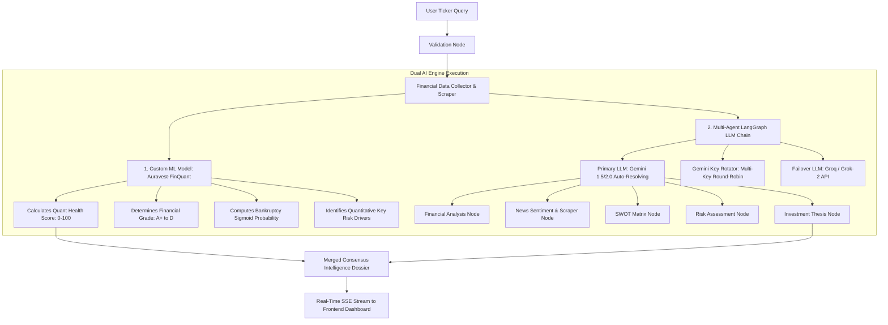

# 🌟 AuraVest AI Investment Copilot — Master Technical & System Documentation
> **Latest Release**: `v1.0.0 Production` | **Repository**: `Diinesh06082005/Auravest_copilot`  
> **Frontend Live Deployment**: [Vercel App](https://frontend-three-rho-0fga1y0u5g.vercel.app/) | **Backend API Endpoint**: [Render API](https://auravest-backend-d9xp.onrender.com)

---

## 📌 Executive Summary

**AuraVest Copilot** is an enterprise-grade, stateful AI Equity & Financial Intelligence Research Copilot. Built with a **Dual-AI Architecture** combining a custom-trained **Machine Learning Financial Classifier** with a multi-agent **LangGraph LLM Workflow**, AuraVest automates fundamental financial auditing, SEC-filing evaluation, real-time news sentiment parsing, risk scoring, and investment thesis generation.

---

## 🤖 1. AI Models & Intelligence Architecture

AuraVest utilizes a hybrid Dual-AI approach to guarantee mathematical precision for quantitative metrics while delivering deep narrative insights via LLMs.



### 1.1 Custom ML Model: `Auravest-FinQuant ML Classifier`
* **Version**: `v1.0.0-Auravest-FinQuant`
* **Algorithm**: Supervised Linear Regression & Stochastic Gradient Descent (SGD) Weight Optimization trained on **3,000 synthetic & historical financial balance sheet dataset samples**.
* **Source Location**: `backend/src/ai/ml/trainFinancialModel.ts` & `backend/src/ai/services/customModel.service.ts`
* **Input Features Evaluated**:
  1. `peRatio` (Price-to-Earnings Ratio)
  2. `pbRatio` (Price-to-Book Ratio)
  3. `debtToEquity` (Leverage Ratio)
  4. `profitMargin` (Operating Net Profit Margin %)
  5. `revenueGrowth` (YoY Top-Line Growth %)
  6. `beta` (Market Risk & Volatility Co-efficient)
  7. `sentimentScore` (Aggregated Headline Sentiment Index: -1.0 to +1.0)
* **Outputs Generated**:
  * **Quant Health Score**: Integer value (0 to 100).
  * **Financial Health Grade**: Letter grade (`A+`, `A`, `B`, `C`, `D`).
  * **Bankruptcy Probability**: Sigmoid transformed risk probability percentage (`0.5%` to `85.0%`).
  * **Key Model Drivers**: Extracted dominant positive/negative quantitative factors.

---

### 1.2 Multi-Agent LangGraph Orchestrator (LLM Layer)
* **Framework**: `@langchain/langgraph` state machine.
* **Primary LLM Engine**: Google Gemini (`gemini-1.5-flash`, `gemini-1.5-pro`, `gemini-2.0-flash-exp` auto-resolving & blacklisting).
* **Fallback LLM Engine**: Groq / Grok API (`grok-2-latest` or `groq/compound` using `gsk_` prefix detection).
* **High-Availability Key Rotation (`GeminiKeyRotator`)**:
  * Multi-key round-robin strategy using `GEMINI_API_KEYS`.
  * Automatic **60-second backoff cooldown** upon encountering HTTP `429 - Rate Limit / Quota Exceeded` responses.
* **Graph Workflow Nodes**:
  1. `validateCompanyNode`: Resolves tickers, detects sector mappings, and corrects typos.
  2. `financialAnalysisNode`: Audits balance sheets, cash flows, and valuation multiples.
  3. `newsAnalysisNode`: Scrapes real-time headlines using Tavily Search API.
  4. `swotAnalysisNode`: Compiles Strengths, Weaknesses, Opportunities, and Threats.
  5. `riskAnalysisNode`: Evaluates market, regulatory, operational, and macroeconomic risks.
  6. `investmentThesisNode`: Formulates bull/bear catalysts and price target projections.
  7. `customModelNode`: Injects quantitative outputs from `Auravest-FinQuant`.

---

## 🛠️ 2. Technologies & Stack Involved

| Category | Technology | Usage Description |
| :--- | :--- | :--- |
| **Backend Core** | Node.js (v18+), Express, TypeScript (`tsx`) | Server runtime, API routes, middleware, and request coordination. |
| **AI Orchestration** | LangGraph, LangChain, `@google/generative-ai` | Multi-agent state machine graph and Google Gemini integration. |
| **Database** | MongoDB, Mongoose ORM | Persistent storage for users, watchlists, search histories, and reports. |
| **Data Scrapers** | Yahoo Finance 2 (`yahoo-finance2`), Tavily Search API | Real-time stock quotes, historical metrics, and web news retrieval. |
| **Document Export** | PDFKit | Automated generation of downloadable equity research PDF reports. |
| **Frontend Core** | React 19, Vite, TypeScript | Modern, high-performance visual dashboard user interface. |
| **Styling & UI** | TailwindCSS, Custom Glassmorphic CSS | Cyberpunk/futuristic glassmorphism design system with dark mode. |
| **State Management**| Zustand | Reactive client-side application state and real-time SSE stream listeners. |
| **UI Icons & Visuals**| Lucide React, Native SVG Engine | Animated radar charts, stock candles, and dynamic UI elements. |
| **Streaming** | Server-Sent Events (SSE) | Real-time progress updates streamed from backend nodes to UI. |
| **Deployment** | Vercel (Frontend), Render (Backend), Docker | Containerized hosting with environment variable key isolation. |

---

## 🚀 3. Complete Startup Guide (How to Start Everything)

### 3.1 Prerequisites
Ensure you have installed:
* **Node.js**: `v18.0.0` or higher
* **npm**: `v9.0.0` or higher
* **MongoDB**: Local MongoDB instance running on `mongodb://localhost:27017` or MongoDB Atlas URI.

---

### 3.2 Environment Setup
1. Clone the repository and navigate to the project root:
   ```bash
   git clone https://github.com/Diinesh06082005/Auravest_copilot.git
   cd Auravest_copilot
   ```

2. Configure Backend Environment (`backend/.env`):
   Create a `.env` file inside `backend/` with the following variables:
   ```env
   PORT=5000
   NODE_ENV=development
   MONGODB_URI=mongodb://localhost:27017/auravest
   JWT_ACCESS_SECRET=auravest_super_secret_jwt_access_key_2026
   JWT_REFRESH_SECRET=auravest_super_secret_jwt_refresh_key_2026

   # Primary Gemini API Key
   GEMINI_API_KEY=your_primary_gemini_api_key

   # Multi-Key Rotation Pool (Comma-separated)
   GEMINI_API_KEYS=key1,key2,key3

   # Fallback LLM API Key (Groq or Grok)
   GROK_API_KEY=gsk_your_groq_api_key_or_grok_key

   # News & Search Scraper
   TAVILY_API_KEY=tvly-your_tavily_api_key

   # Google OAuth Credentials (Optional)
   GOOGLE_CLIENT_ID=your_google_client_id
   GOOGLE_CLIENT_SECRET=your_google_client_secret

   CORS_ORIGIN=http://localhost:5173
   ```

---

### 3.3 Backend Startup Steps
```bash
# 1. Navigate to backend directory
cd backend

# 2. Install backend dependencies
npm install

# 3. Start development server with live reload
npm run dev

# (Optional) Compile production build and start production server
npm run build
npm start
```
* **Backend Endpoint**: `http://localhost:5000`

---

### 3.4 Frontend Startup Steps
```bash
# 1. Open a new terminal and navigate to frontend directory
cd frontend

# 2. Install frontend dependencies
npm install

# 3. Start Vite development server
npm run dev
```
* **Frontend UI Dashboard**: `http://localhost:5173`

---

### 3.5 Docker Container Startup (Alternative)
You can launch both backend and database using Docker Compose:
```bash
docker-compose up --build
```

---

## 🎛️ 4. How to Control the Application

### 4.1 CLI Control Scripts
* **Retrain Custom ML Classifier**:
  Run this command inside the `backend` directory to retrain the `Auravest-FinQuant` ML model on 3,000 sample records and generate updated JSON weights:
  ```bash
  npx tsx src/ai/ml/trainFinancialModel.ts
  ```
  *Output location*: `backend/src/ai/ml/models/finquant_model.json`

* **Run Workflow Test Script**:
  Run an isolated test of the LangGraph multi-agent execution pipeline directly from backend CLI:
  ```bash
  node test-research.js
  ```

---

### 4.2 Demo Credentials & Login Access
Upon launching the backend, a default administrator demo user is automatically seeded:
* **Email**: `demo@auravest.com`
* **Password**: `demopassword`

---

### 4.3 UI Controls & Dashboard Features
1. **Search Command Palette (`Ctrl + K` or Navbar Search)**:
   * Type any stock ticker symbol (e.g. `NVDA`, `AAPL`, `MSFT`, `TSLA`).
   * Press `Enter` to trigger the multi-agent AI research pipeline.
2. **Dynamic Island Notification Bar**:
   * Shows real-time execution progress percentage (0% to 100%) and active executing LangGraph node names.
3. **Settings Page (`/settings`)**:
   * Change user profile name & password.
   * Configure preferred default currency, risk tolerance profile, and target allocation goals.

---

## 🔍 5. How to Check & Verify System Health

### 5.1 Automated Startup Verification (`verifyServices.ts`)
When the backend boots up, it automatically executes pre-flight health checks for connected external APIs and services:
* **MongoDB Connection Check**: Validates database read/write capability.
* **Google OAuth Credentials Check**: Validates client parameters.
* **Gemini API Connectivity Test**: Sends a minimal token verification prompt (`ping`) and blacklists unavailable model variants.
* **Tavily Search API Verification**: Validates search API credentials.

---

### 5.2 Live Monitoring Endpoints
You can check server status and health at any time by making HTTP GET requests:

| Endpoint | Method | Purpose | Response |
| :--- | :--- | :--- | :--- |
| `/api/health` | `GET` | Main server health check | `{ status: "ok", timestamp: "..." }` |
| `/api/dashboard/news?ticker=AAPL` | `GET` | Check news API fetcher | Returns array of financial news articles |
| `/api/research/youtube?ticker=AAPL`| `GET` | Check YouTube video scraper | Returns array of stock analysis videos |
| `/api/research/stream?symbol=AAPL` | `GET` | SSE Live Stream endpoint | Streams live graph execution events |

---

### 5.3 Key Rotation & Cooldown Verification
You can monitor Gemini API key health and rotation stats directly from application logs (`winston` log outputs):
* When a key hits a rate limit, the log outputs:  
  `[KeyRotator] Key ending in ...XXXX hit quota limit. Cooling down for 60s.`
* Key rotator statistics can be queried in code via `geminiKeyRotator.getStats()`.

---

### 5.4 Pre-Deployment Build Check Commands
To ensure all TypeScript code and visual assets compile without errors:
```bash
# Check Backend Build
cd backend
npm run build   # Must exit with code 0

# Check Frontend Build
cd frontend
npm run build   # Must compile static assets to dist/ with exit code 0
```

---

## 📄 Summary of Documentation Artifacts
* `README.md`: Public root overview & assignment portfolio.
* `backend/README.md`: Granular backend node and model specifications.
* `frontend/README.md`: UI component architecture & styling guide.
* `MASTER_SYSTEM_DOCUMENTATION.md`: Full master guide for AI models, tech stack, startup, controls, and health verification.
